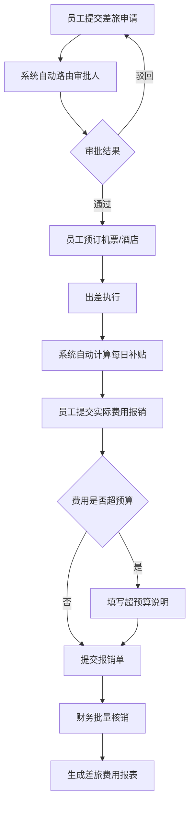

## 1. 产品概述

企业差旅申请与管理系统，面向中大型企业，解决差旅审批流程不规范、费用管控困难、报销核销效率低的问题。目标用户包括普通员工、部门经理、财务人员和系统管理员，通过数字化差旅全流程管理，实现申请-审批-预订-报销-分析闭环，降低差旅成本15%-20%。

## 2. 核心功能

### 2.1 用户角色

| 角色 | 注册方式 | 核心权限 |
|------|----------|----------|
| 普通员工 | 管理员分配账号 | 提交差旅申请、预订机票酒店、提交报销、查看个人差旅记录 |
| 部门经理 | 管理员分配账号 | 审批下属差旅申请、查看部门差旅统计 |
| 财务人员 | 管理员分配账号 | 批量核销报销、生成差旅费用报表、管理补贴标准 |
| 系统管理员 | 系统初始账号 | 管理用户与职级、审批路由配置、城市补贴标准配置 |

### 2.2 功能模块

1. **工作台首页**：待办事项提醒、差旅数据概览、快捷操作入口
2. **差旅申请**：新建申请、申请列表、申请详情与审批流程
3. **差旅预订**：机票搜索与预订、酒店搜索与预订、预订记录管理
4. **差旅报销**：实际费用填报、超预算说明、报销单列表
5. **财务核销**：批量核销操作、核销记录查询
6. **数据报表**：月度差旅费用报表、按部门/目的地维度分析
7. **系统管理**：用户管理、审批路由配置、城市补贴标准

### 2.3 页面详情

| 页面名称 | 模块名称 | 功能描述 |
|----------|----------|----------|
| 工作台 | 待办提醒 | 显示待审批/待报销/待核销数量，点击跳转对应列表 |
| 工作台 | 数据概览 | 本月差旅总费用、同比环比、部门费用排名Top5 |
| 差旅申请-新建 | 基本信息填写 | 目的地城市、出行日期、行程目的、同行人员 |
| 差旅申请-新建 | 预估费用 | 交通费、住宿费、餐饮费、其他费用，合计自动计算 |
| 差旅申请-新建 | 审批路由预览 | 根据金额和职级自动显示审批链路 |
| 差旅申请-列表 | 筛选与搜索 | 按状态/日期/部门筛选，关键词搜索 |
| 差旅申请-详情 | 审批流程 | 显示当前审批节点、历史审批记录、审批意见 |
| 差旅申请-详情 | 关联预订 | 显示关联的机票和酒店预订记录 |
| 差旅预订 | 机票搜索 | 输入出发地/目的地/日期，模拟搜索航班列表 |
| 差旅预订 | 酒店搜索 | 输入城市/入住日期/退房日期，模拟搜索酒店列表 |
| 差旅预订 | 预订确认 | 确认预订后自动关联到申请单 |
| 差旅报销-填报 | 费用明细 | 按类别填写实际发生费用，上传票据图片 |
| 差旅报销-填报 | 超预算说明 | 超出预算部分强制填写说明 |
| 差旅报销-填报 | 补贴计算 | 按目的地城市标准自动计算每日补贴天数×标准 |
| 财务核销 | 批量核销 | 勾选多条报销单批量核销，标记核销状态与日期 |
| 数据报表 | 月度费用报表 | 柱状图/折线图展示月度费用趋势 |
| 数据报表 | 部门维度分析 | 饼图/柱状图按部门展示费用占比 |
| 数据报表 | 目的地维度分析 | 表格/地图可视化按城市展示费用分布 |
| 系统管理-审批路由 | 路由配置 | 按金额区间+职级配置审批人链路 |
| 系统管理-补贴标准 | 城市标准 | 按城市等级配置每日住宿/餐饮/交通补贴金额 |
| 系统管理-用户管理 | 用户列表 | 增删改用户、分配角色与职级 |

## 3. 核心流程

员工出差前在系统提交差旅申请，填写目的地、出行日期、行程目的和预估费用。系统根据金额大小和员工职级自动路由到对应审批人链路。审批人逐级审批通过后，员工可在系统内搜索并预订机票和酒店（对接第三方差旅平台API），预订记录自动关联到申请单。出差期间，系统按目的地城市补贴标准自动计算每日补贴。出差回程后，员工提交实际发生费用，超出预算部分需额外说明。财务人员按申请单批量核销报销，系统生成每月差旅费用报表，支持按部门和目的地维度分析差旅支出结构。

## 4. 用户界面设计

### 4.1 设计风格

- **主色调**：深靛蓝 (#1e3a5f) 作为品牌主色，搭配琥珀橙 (#e67e22) 作为强调色
- **辅助色**：石板灰 (#64748b)、翡翠绿 (#10b981) 用于状态指示、珊瑚红 (#ef4444) 用于警告
- **按钮风格**：圆角微立体（8px圆角，轻微阴影），主操作按钮深靛蓝填充，次要操作灰色描边
- **字体**：标题使用 Noto Sans SC Bold，正文使用 Noto Sans SC Regular，数字使用 DM Mono
- **布局风格**：左侧固定导航栏 + 右侧内容区，卡片式内容组织，顶部面包屑导航
- **图标风格**：Lucide 线性图标，2px 描边，统一 20px 尺寸

### 4.2 页面设计概览

| 页面名称 | 模块名称 | UI元素 |
|----------|----------|--------|
| 工作台 | 待办提醒 | 卡片布局，每类待办一张统计卡片，数字大字+图标，点击跳转链接 |
| 工作台 | 数据概览 | 数字指标卡片 + 折线图（月度趋势）+ 横向柱状图（部门排名） |
| 差旅申请-新建 | 基本信息填写 | 分步表单，步骤指示器，表单字段分组卡片，下拉选择城市 |
| 差旅申请-新建 | 预估费用 | 表格式费用明细，行内编辑，底部合计行 |
| 差旅申请-新建 | 审批路由预览 | 垂直步骤条，显示审批人头像+姓名+职级 |
| 差旅申请-列表 | 筛选与搜索 | 顶部筛选栏（状态标签组+日期范围+部门下拉），表格列表 |
| 差旅申请-详情 | 审批流程 | 左侧内容区+右侧审批时间线，状态标签色块 |
| 差旅预订 | 机票搜索 | 搜索表单卡片+航班结果列表卡片，每条航班信息行 |
| 差旅预订 | 酒店搜索 | 搜索表单卡片+酒店网格卡片（图片+名称+价格+评分） |
| 差旅报销-填报 | 费用明细 | 可增删的费用行表格，类别下拉+金额+票据上传按钮 |
| 差旅报销-填报 | 补贴计算 | 只读信息卡片，显示天数×标准=补贴金额 |
| 财务核销 | 批量核销 | 表格+复选框，顶部批量操作栏，状态徽章 |
| 数据报表 | 月度费用报表 | 顶部筛选（月份选择器），图表区（柱状图+折线图） |
| 数据报表 | 部门维度分析 | 饼图+明细表格双栏布局 |
| 数据报表 | 目的地维度分析 | 排名表格+横向柱状图 |
| 系统管理 | 各子模块 | 标准CRUD表格+弹窗表单 |

### 4.3 响应式设计

- 桌面优先设计，最小支持 1280px 宽度
- 侧边栏在 1024px 以下折叠为图标模式
- 表格在小屏幕下支持横向滚动
- 卡片网格在大屏3列、中屏2列、小屏1列

### 4.4 3D场景指引

不适用
