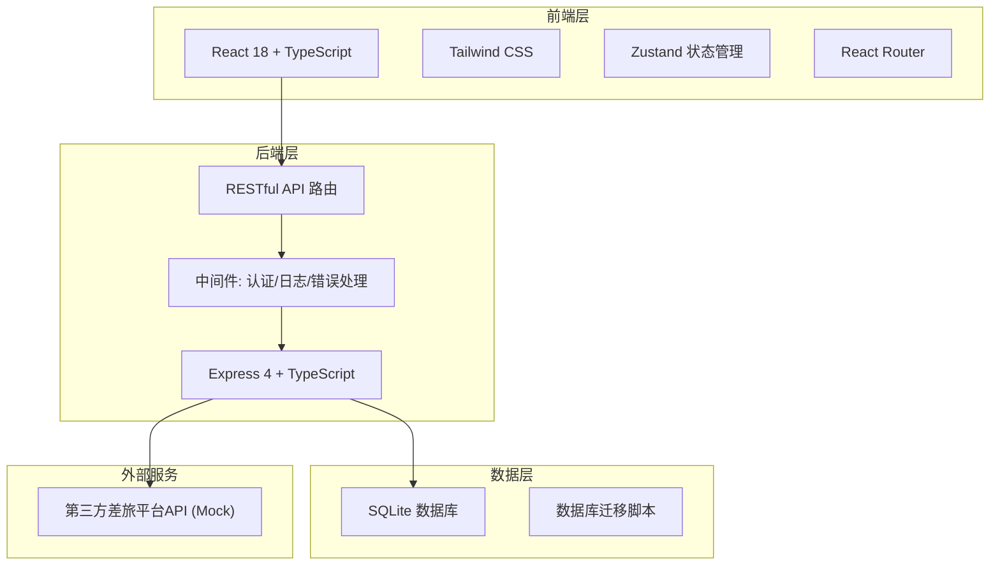
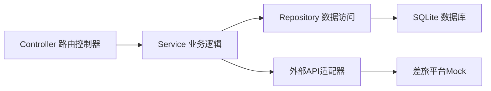
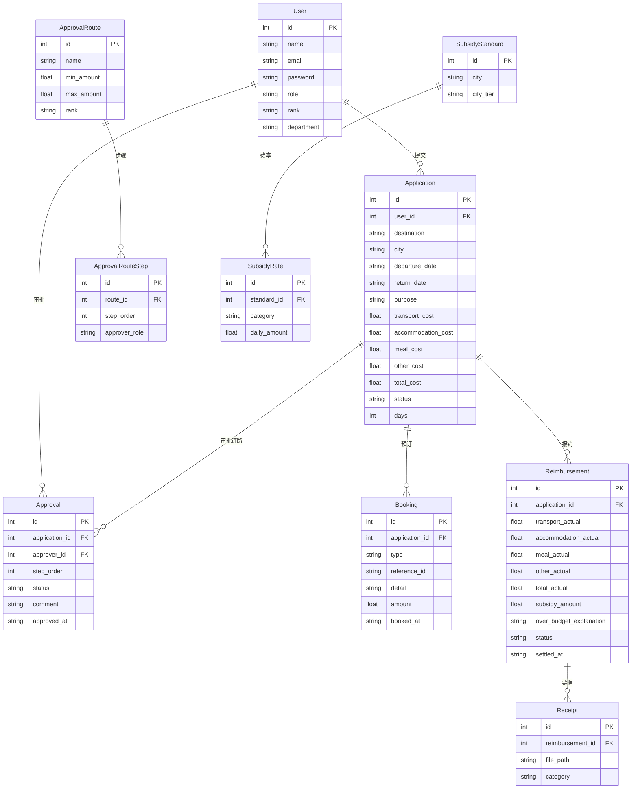

## 1. 架构设计



## 2. 技术说明

- **前端**：React@18 + tailwindcss@3 + vite
- **初始化工具**：vite-init (react-express-ts 模板)
- **后端**：Express@4 + TypeScript (ESM)
- **数据库**：SQLite (better-sqlite3)，使用迁移脚本管理
- **状态管理**：Zustand
- **图表库**：Recharts
- **图标库**：lucide-react
- **日期处理**：date-fns
- **第三方差旅API**：Mock实现，预留真实接口对接

## 3. 路由定义

| 路由 | 用途 |
|------|------|
| `/` | 工作台首页 |
| `/applications` | 差旅申请列表 |
| `/applications/new` | 新建差旅申请 |
| `/applications/:id` | 申请详情（含审批流程） |
| `/bookings` | 差旅预订（机票/酒店搜索） |
| `/bookings/:applicationId` | 关联申请单的预订页面 |
| `/reimbursements` | 差旅报销列表 |
| `/reimbursements/new/:applicationId` | 新建报销单 |
| `/reimbursements/:id` | 报销详情 |
| `/finance` | 财务核销 |
| `/reports` | 数据报表 |
| `/admin/users` | 用户管理 |
| `/admin/approval-routes` | 审批路由配置 |
| `/admin/subsidy-standards` | 城市补贴标准 |

## 4. API 定义

### 4.1 认证

```typescript
POST /api/auth/login
  Request: { username: string; password: string }
  Response: { token: string; user: User }

GET /api/auth/me
  Response: { user: User }
```

### 4.2 差旅申请

```typescript
GET /api/applications?page=1&size=20&status=&department=
  Response: { list: Application[]; total: number }

POST /api/applications
  Request: {
    destination: string;
    city: string;
    departureDate: string;
    returnDate: string;
    purpose: string;
    estimatedCosts: {
      transport: number;
      accommodation: number;
      meal: number;
      other: number;
    };
    companions: string[];
  }
  Response: Application

GET /api/applications/:id
  Response: Application & { approvalChain: ApprovalNode[]; bookings: Booking[] }

PUT /api/applications/:id/approve
  Request: { approved: boolean; comment: string }
  Response: Application
```

### 4.3 差旅预订

```typescript
GET /api/flights/search?from=&to=&date=
  Response: Flight[]

POST /api/bookings/flight
  Request: { applicationId: string; flightId: string }
  Response: Booking

GET /api/hotels/search?city=&checkIn=&checkOut=
  Response: Hotel[]

POST /api/bookings/hotel
  Request: { applicationId: string; hotelId: string; roomType: string; checkIn: string; checkOut: string }
  Response: Booking
```

### 4.4 差旅报销

```typescript
POST /api/reimbursements
  Request: {
    applicationId: string;
    actualCosts: {
      transport: number;
      accommodation: number;
      meal: number;
      other: number;
    };
    overBudgetExplanation?: string;
    receipts: string[];
  }
  Response: Reimbursement

GET /api/reimbursements?page=1&size=20&status=
  Response: { list: Reimbursement[]; total: number }
```

### 4.5 财务核销

```typescript
POST /api/finance/settle
  Request: { reimbursementIds: string[] }
  Response: { settled: number }

GET /api/finance/pending?page=1&size=20
  Response: { list: Reimbursement[]; total: number }
```

### 4.6 数据报表

```typescript
GET /api/reports/monthly?year=2026&month=6
  Response: {
    totalExpense: number;
    byDepartment: { department: string; amount: number }[];
    byDestination: { city: string; amount: number }[];
    trend: { month: string; amount: number }[];
  }
```

### 4.7 系统管理

```typescript
GET /api/admin/users
  Response: User[]

POST /api/admin/users
  Request: { name: string; email: string; role: string; rank: string; department: string }

PUT /api/admin/users/:id
  Request: Partial<User>

GET /api/admin/approval-routes
  Response: ApprovalRoute[]

PUT /api/admin/approval-routes/:id
  Request: Partial<ApprovalRoute>

GET /api/admin/subsidy-standards
  Response: SubsidyStandard[]

PUT /api/admin/subsidy-standards/:id
  Request: Partial<SubsidyStandard>
```

## 5. 服务器架构图



## 6. 数据模型

### 6.1 数据模型定义



### 6.2 数据定义语言

```sql
CREATE TABLE users (
  id INTEGER PRIMARY KEY AUTOINCREMENT,
  name TEXT NOT NULL,
  email TEXT NOT NULL UNIQUE,
  password TEXT NOT NULL,
  role TEXT NOT NULL CHECK(role IN ('employee', 'manager', 'finance', 'admin')),
  rank TEXT NOT NULL CHECK(rank IN ('junior', 'senior', 'director', 'vp')),
  department TEXT NOT NULL,
  created_at TEXT DEFAULT (datetime('now'))
);

CREATE TABLE applications (
  id INTEGER PRIMARY KEY AUTOINCREMENT,
  user_id INTEGER NOT NULL REFERENCES users(id),
  destination TEXT NOT NULL,
  city TEXT NOT NULL,
  departure_date TEXT NOT NULL,
  return_date TEXT NOT NULL,
  purpose TEXT NOT NULL,
  transport_cost REAL DEFAULT 0,
  accommodation_cost REAL DEFAULT 0,
  meal_cost REAL DEFAULT 0,
  other_cost REAL DEFAULT 0,
  total_cost REAL DEFAULT 0,
  status TEXT NOT NULL DEFAULT 'pending' CHECK(status IN ('pending', 'approved', 'rejected', 'cancelled')),
  days INTEGER NOT NULL,
  created_at TEXT DEFAULT (datetime('now')),
  updated_at TEXT DEFAULT (datetime('now'))
);

CREATE TABLE approvals (
  id INTEGER PRIMARY KEY AUTOINCREMENT,
  application_id INTEGER NOT NULL REFERENCES applications(id),
  approver_id INTEGER NOT NULL REFERENCES users(id),
  step_order INTEGER NOT NULL,
  status TEXT NOT NULL DEFAULT 'pending' CHECK(status IN ('pending', 'approved', 'rejected')),
  comment TEXT,
  approved_at TEXT,
  created_at TEXT DEFAULT (datetime('now'))
);

CREATE TABLE bookings (
  id INTEGER PRIMARY KEY AUTOINCREMENT,
  application_id INTEGER NOT NULL REFERENCES applications(id),
  type TEXT NOT NULL CHECK(type IN ('flight', 'hotel')),
  reference_id TEXT,
  detail TEXT,
  amount REAL DEFAULT 0,
  booked_at TEXT DEFAULT (datetime('now'))
);

CREATE TABLE reimbursements (
  id INTEGER PRIMARY KEY AUTOINCREMENT,
  application_id INTEGER NOT NULL REFERENCES applications(id),
  transport_actual REAL DEFAULT 0,
  accommodation_actual REAL DEFAULT 0,
  meal_actual REAL DEFAULT 0,
  other_actual REAL DEFAULT 0,
  total_actual REAL DEFAULT 0,
  subsidy_amount REAL DEFAULT 0,
  over_budget_explanation TEXT,
  status TEXT NOT NULL DEFAULT 'pending' CHECK(status IN ('pending', 'settled')),
  settled_at TEXT,
  created_at TEXT DEFAULT (datetime('now'))
);

CREATE TABLE receipts (
  id INTEGER PRIMARY KEY AUTOINCREMENT,
  reimbursement_id INTEGER NOT NULL REFERENCES reimbursements(id),
  file_path TEXT,
  category TEXT,
  created_at TEXT DEFAULT (datetime('now'))
);

CREATE TABLE approval_routes (
  id INTEGER PRIMARY KEY AUTOINCREMENT,
  name TEXT NOT NULL,
  min_amount REAL DEFAULT 0,
  max_amount REAL DEFAULT 999999,
  rank TEXT NOT NULL,
  created_at TEXT DEFAULT (datetime('now'))
);

CREATE TABLE approval_route_steps (
  id INTEGER PRIMARY KEY AUTOINCREMENT,
  route_id INTEGER NOT NULL REFERENCES approval_routes(id),
  step_order INTEGER NOT NULL,
  approver_role TEXT NOT NULL,
  created_at TEXT DEFAULT (datetime('now'))
);

CREATE TABLE subsidy_standards (
  id INTEGER PRIMARY KEY AUTOINCREMENT,
  city TEXT NOT NULL,
  city_tier TEXT NOT NULL CHECK(city_tier IN ('tier1', 'tier2', 'tier3')),
  created_at TEXT DEFAULT (datetime('now'))
);

CREATE TABLE subsidy_rates (
  id INTEGER PRIMARY KEY AUTOINCREMENT,
  standard_id INTEGER NOT NULL REFERENCES subsidy_standards(id),
  category TEXT NOT NULL CHECK(category IN ('accommodation', 'meal', 'transport')),
  daily_amount REAL NOT NULL,
  created_at TEXT DEFAULT (datetime('now'))
);
```
